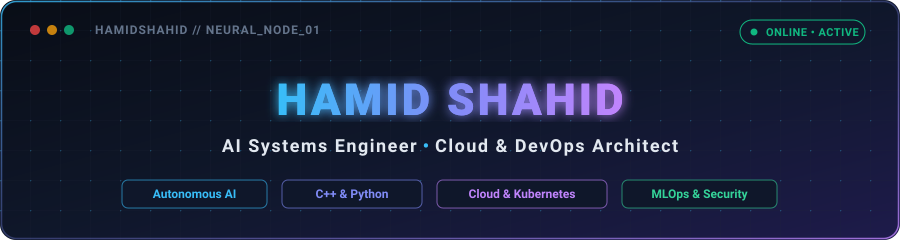

  

   

  

    

  

    
    &nbsp;
    
    &nbsp;
    
    &nbsp;
    
  

---

### About Me

I am an AI Systems Engineer and Cloud & DevOps Architect specializing in autonomous multi-agent workflows, scalable retrieval-augmented generation (RAG) pipelines, and high-performance computing. Operating at the intersection of low-latency systems engineering (C++ and Python) and cloud-native infrastructure (Docker and Kubernetes), I bridge the gap between machine learning models and resilient, production-ready architectures built for scale and security.

---

### Core Tech Stack

<table border="0">
  <tr>
    <td align="center" width="33%"><b>Languages &amp; Systems</b></td>
    <td align="center" width="33%"><b>AI &amp; Backend</b></td>
    <td align="center" width="33%"><b>Cloud &amp; DevOps</b></td>
  </tr>
  <tr>
    <td align="center" valign="top">
      
       <b>Python • C++ • Linux</b>
    </td>
    <td align="center" valign="top">
      
       <b>PyTorch • FastAPI • PostgreSQL</b>
    </td>
    <td align="center" valign="top">
      
       <b>Docker • Kubernetes • AWS</b>
    </td>
  </tr>
</table>

#### Production AI Architecture Layers

Beyond raw tools, production-grade AI systems require a structured architectural pipeline across each layer of the modern AI stack:

- **Compute & Systems:** C++, Python, CUDA/Triton kernels, and Linux GPU clusters for compute-bound performance and low-latency execution.
- **Modeling & Training:** PyTorch, Hugging Face Transformers, fine-tuning pipelines (LoRA/QLoRA), and open-weights reasoning models.
- **Agentic Orchestration:** LangGraph, LangChain, and LlamaIndex for stateful multi-agent workflows, tool-use loops, and autonomous task execution.
- **Context & Retrieval (RAG):** Vector databases (Qdrant, Pinecone, pgvector), dense-sparse hybrid search, cross-encoder rerankers, and semantic chunking.
- **Serving & High-Throughput Inference:** vLLM, Ollama, TensorRT-LLM, model quantization (AWQ/GGUF), asynchronous streaming APIs via FastAPI and gRPC.
- **MLOps, Cloud & Guardrails:** Docker, Kubernetes (GPU-aware autoscaling), Terraform, CI/CD automation, observability, and security guardrails.

---

### Top Languages by Repository

  

    

  

    
    &nbsp;
    
    &nbsp;
    
    &nbsp;
    
  

  Click the visualization or any language pill above to directly inspect matching repositories on GitHub.

---

  
<i>"Simplicity is the prerequisite for reliability."</i> — Edsger W. Dijkstra

  
Open for discussions on AI Engineering, Cloud Infrastructure, and High-Performance Systems.

